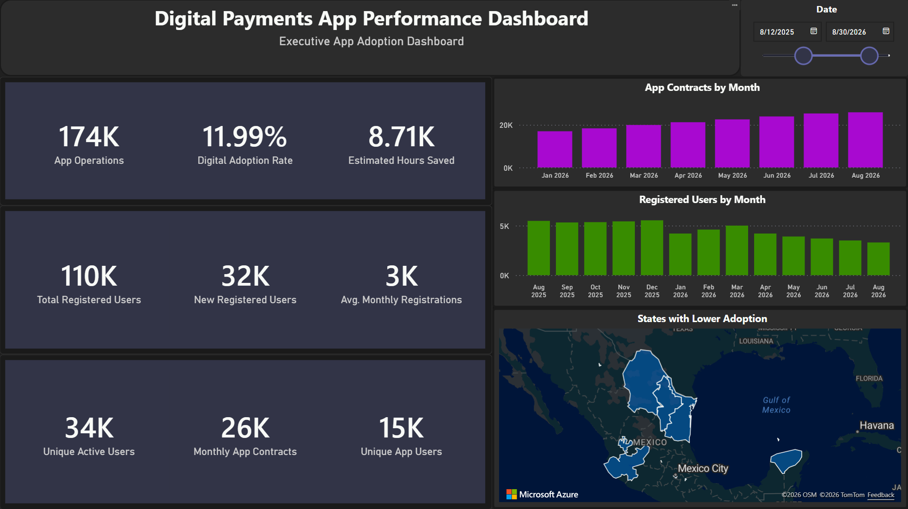
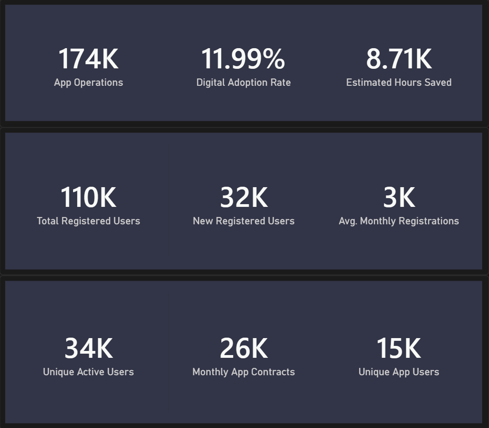
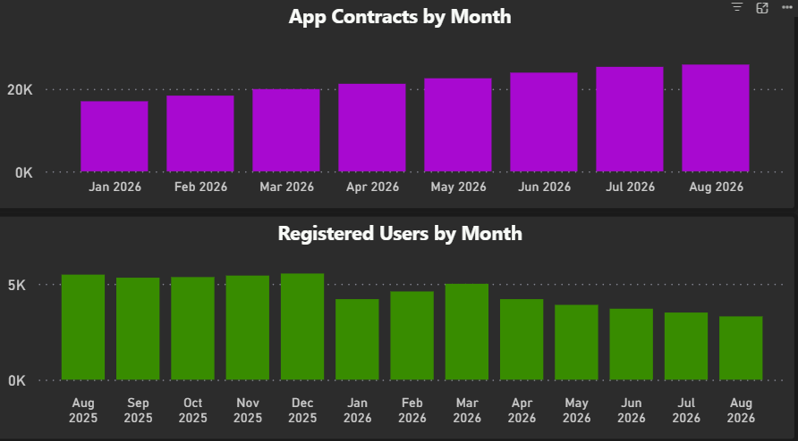
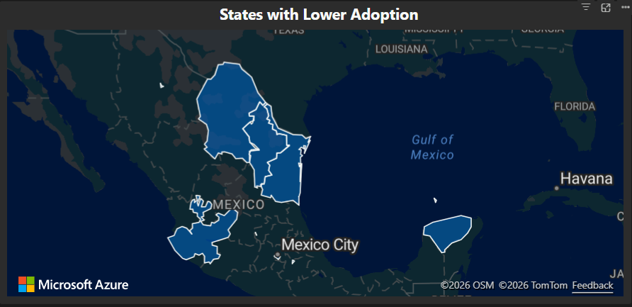

# Digital Payments App Performance Dashboard

A Power BI dashboard for monitoring synthetic digital payment app adoption, registered users, app operations, monthly contracts, estimated hours saved, and regional adoption patterns.

> This dashboard uses synthetic data created for portfolio purposes. It does not contain confidential client information, production data, or proprietary business metrics.

## Overview
This project packages a completed Power BI dashboard into a clean, public portfolio repository. The dashboard focuses on adoption and performance signals for a digital payments app, with emphasis on executive visibility and regional insights.

## Business Problem
Organizations with digital payment apps need a clear view of adoption and operational performance. Decision-makers must track user registration, app-based operations, contract volume, estimated operational efficiency, and regional adoption gaps to identify growth opportunities and support operational planning.

## Dashboard Features
- Executive KPI cards
- Date range filtering
- Monthly app contract trends
- Monthly registered user trends
- Regional adoption map
- Dark executive dashboard layout
- Synthetic data for public sharing

## Key KPIs
- App Operations
- Digital Adoption Rate
- Estimated Hours Saved
- Total Registered Users
- New Registered Users
- Average Monthly Users
- Unique Active Users
- Monthly App Contracts
- Unique App Users
- Lower Adoption States

## Screenshots





## Tools Used
- Power BI
- DAX
- Power Query
- Data visualization
- Business intelligence
- Synthetic data modeling

## Repository Structure
```text
digital-payments-app-performance-dashboard/
├── README.md
├── .gitignore
├── powerbi/
│   └── digital_payments_app_performance_dashboard.pbix
├── screenshots/
│   ├── 01_dashboard_overview.png
│   ├── 02_kpi_summary.png
│   ├── 03_monthly_trends.png
│   └── 04_lower_adoption_states.png
├── docs/
│   ├── kpi_definitions.md
│   ├── data_notes.md
│   ├── dashboard_design.md
│   └── limitations.md
├── data/
│   └── README.md
└── assets/
    └── .gitkeep
```

## How to Explore
1. Open `powerbi/digital_payments_app_performance_dashboard.pbix` in Power BI Desktop.
2. Review KPI cards for the main business performance indicators.
3. Use the date filter to inspect monthly changes.
4. Compare trend charts and regional adoption patterns.
5. Replace screenshot placeholders with exported dashboard images.

## Limitations
- Synthetic dataset only.
- Portfolio-focused exploratory dashboard, not a production report.
- No confidential client data or proprietary production metrics.
- KPI definitions are portfolio-oriented and may differ from implementation in live business environments.
- Additional validation is required before operational use.

## Future Improvements
- Add drill-through pages for deeper state-level diagnostics.
- Add cohort views for user retention and behavior trends.
- Include scenario analysis for adoption and contract growth planning.
- Introduce documented KPI formulas where business rules are formally defined.
